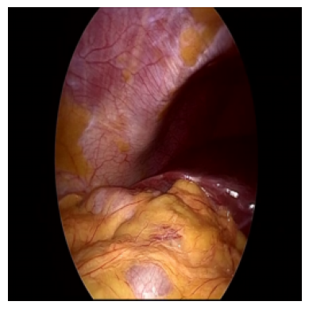
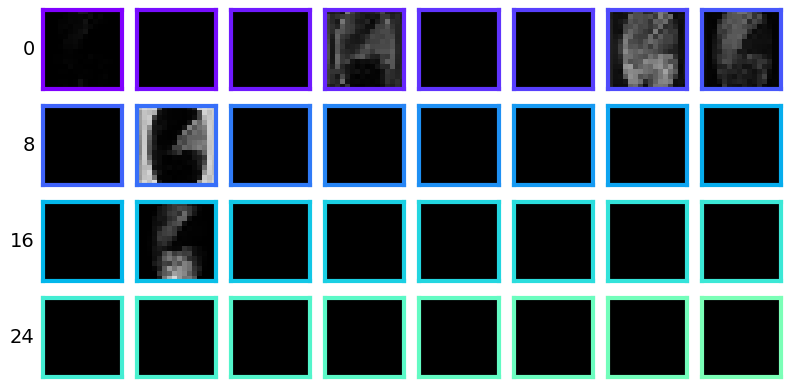
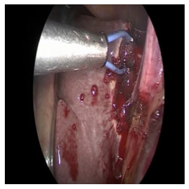
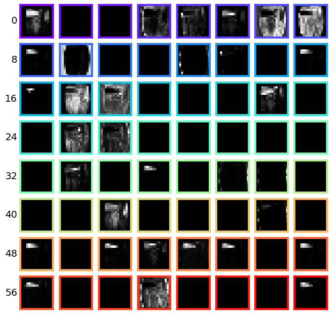

# Challenges of Decomposing Tools in Surgical Scenes Through Disentangling The Latent Representations


This repository contains the PyTorch implementation of the network described in the paper [Challenges of Decomposing Tools in Surgical Scenes Through Disentangling The Latent Representations](https://openreview.net/forum?id=vwDshzzBrl&referrer=%5Bthe%20profile%20of%20Sai%20Lokesh%20Gorantla%5D(%2Fprofile%3Fid%3D~Sai_Lokesh_Gorantla1)) presented at the workshop ICBINB at ICLR, 2025.

## vMF distributions


## Dataset
The proposed approach was tested on Cholec80 dataset which can be downloaded by following the steps listed at [https://github.com/CAMMA-public/TF-Cholec80](https://github.com/CAMMA-public/TF-Cholec80).

## Preprocessing
After downloading the Cholec80 dataset, modify the path to the video folders in the files [`train.txt`](data/train.txt) and [`val.txt`](data/val.txt). Next, modify the path to annotations folder in the config files in [`stage_1`](stage_1) and [`stage_2`](stage_2) folders.

Install the necessary python packages by running

```
pip install -r requirements.txt
```

## Training

The following steps are common for both Stage 1 and Stage 2. Clearly, Stage 1 training needs to be performed prior to Stage 2. 

Initialize the vMF kernels randomly by running the following commands.

```
python init_vmf.py
```

Change the training hyperparameters in the file [config.py](stage_1/config.py) and run the training script.

```
python train.py
```

## Inference

Run the inference script in both the stages to perform inference. The default paths to checkpoints used for inference are set to pretrained weights available in the folder [checkpoints](checkpoints). Running the inference will save the input image, reconstructed image and the disentangled image 

```
python inference.py
```

### Stage 1

| Input image | Disentangled image |
|---------|---------|
|  |  |

vMF kernel update through the epochs:


### Stage 2

| Input image | Disentangled image |
|---------|---------|
|  |  |

vMF kernel update through the epochs:


### Progressive image reconstruction


## Acknowlegement
Part of the code is based on [vMFNet](https://github.com/vios-s/vMFNet) and [Compositional Nets](https://github.com/AdamKortylewski/CompositionalNets).

The animations in the README.md file are generated using ManimCE, and the source code is available at [animations.py](assets/animations.py)

## License
All scripts are released under the MIT License.